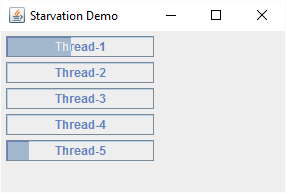
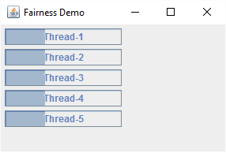

###线程饥饿和线程公平

如果CPU被其他线程占用而导致某个线程一直无法获得CPU执行时间，这就叫做饥饿。解决饥饿的方案被称之为“公平性” – 即所有线程均能公平地获得运行机会。

关于”饥饿“的比喻：
在“首堵”北京的某一天，天气阴沉，空气中充斥着雾霾和地沟油的味道，某个苦逼的临时工交警正在处理塞车，有两条道A和B上都堵满了车辆，其中A道堵的时间最长，B相对相对堵的时间较短，这时，前面道路已疏通，交警按照最佳分配原则，示意B道上车辆先过，B道路上过了一辆又一辆，A道上排队时间最长的确没法通过，只能等B道上没有车辆通过的时候再等交警发指令让A道依次通过，这也就是ReentrantLock显示锁里提供的不公平锁机制（当然了，ReentrantLock也提供了公平锁的机制，由用户根据具体的使用场景而决定到底使用哪种锁策略），不公平锁能够提高吞吐量但不可避免的会造成某些线程的饥饿。

在Java中，下面三个常见的原因会导致线程饥饿：

1. 高优先级线程吞噬所有的低优先级线程的CPU时间。
2. 线程被永久堵塞在一个等待进入同步块的状态，因为其他线程总是能在它之前持续地对该同步块进行访问。
3. 线程在等待一个本身(在其上调用wait())也处于永久等待完成的对象，因为其他线程总是被持续地获得唤醒。

饥饿示例

	public class StarvationDemo {
	    private static Object sharedObj = new Object();
	
	    public static void main (String[] args) {
	        JFrame frame = createFrame();
	        frame.setLayout(new FlowLayout(FlowLayout.LEFT));
	
	        for (int i = 0; i < 5; i++) {
	            ProgressThread progressThread = new ProgressThread();
	            frame.add(progressThread.getProgressComponent());
	            progressThread.start();
	        }
	
	        frame.setLocationRelativeTo(null);
	        frame.setVisible(true);
	    }
	
	    private static JFrame createFrame () {
	        JFrame frame = new JFrame("Starvation Demo");
	        frame.setDefaultCloseOperation(JFrame.EXIT_ON_CLOSE);
	        frame.setSize(new Dimension(300, 200));
	        return frame;
	    }
	
	    private static class ProgressThread extends Thread {
	        JProgressBar progressBar;
	
	        ProgressThread () {
	            progressBar = new JProgressBar();
	            progressBar.setString(this.getName());
	            progressBar.setStringPainted(true);
	        }
	
	        JComponent getProgressComponent () {
	            return progressBar;
	        }
	
	        @Override
	        public void run () {
	
	            int c = 0;
	            while (true) {
	                synchronized (sharedObj) {
	                    if (c == 100) {
	                        c = 0;
	                    }
	                    progressBar.setValue(++c);
	                    try {
	                        //sleep the thread to simulate long running task
	                        Thread.sleep(100);
	                    } catch (InterruptedException e) {
	                        e.printStackTrace();
	                    }
	                }
	            }
	        }
	    }
	}

输出：

公平性示例
	
	public class FairnessDemo {
	    private static Object sharedObj = new Object();
	
	    public static void main (String[] args) {
	        JFrame frame = createFrame();
	        frame.setLayout(new FlowLayout(FlowLayout.LEFT));
	
	        for (int i = 0; i < 5; i++) {
	            ProgressThread progressThread = new ProgressThread();
	            frame.add(progressThread.getProgressComponent());
	            progressThread.start();
	        }
	
	        frame.setLocationRelativeTo(null);
	        frame.setVisible(true);
	    }
	
	    private static JFrame createFrame () {
	        JFrame frame = new JFrame("Fairness Demo");
	        frame.setDefaultCloseOperation(JFrame.EXIT_ON_CLOSE);
	        frame.setSize(new Dimension(300, 200));
	        return frame;
	    }
	
	    private static class ProgressThread extends Thread {
	        JProgressBar progressBar;
	
	        ProgressThread () {
	            progressBar = new JProgressBar();
	            progressBar.setString(this.getName());
	            progressBar.setStringPainted(true);
	        }
	
	        JComponent getProgressComponent () {
	            return progressBar;
	        }
	
	        @Override
	        public void run () {
	
	            int c = 0;
	            while (true) {
	                synchronized (sharedObj) {
	                    if (c == 100) {
	                        c = 0;
	                    }
	                    progressBar.setValue(++c);
	                    try {
	                        //simulate long running task with wait..
	                        // releasing the lock for long running task gives
	                        //fair chances to run other threads
	                        sharedObj.wait(100);
	                    } catch (InterruptedException e) {
	                        e.printStackTrace();
	                    }
	                }
	            }
	        }
	    }
	}

输出：

