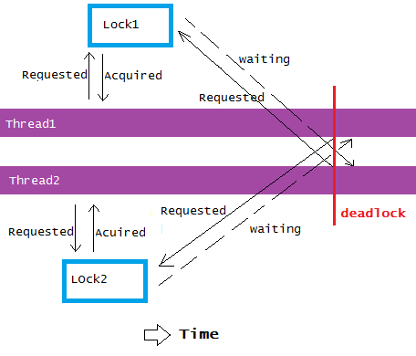
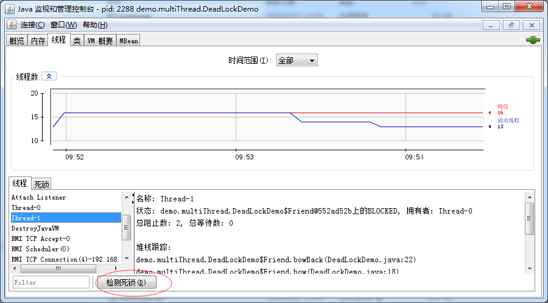
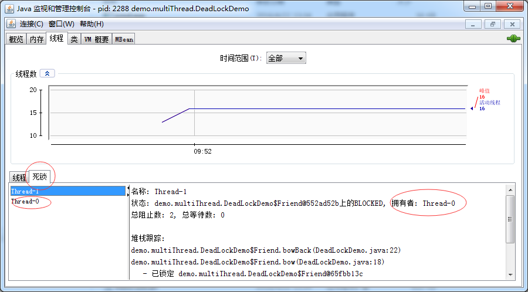

###线程死锁

**死锁：**是指两个或两个以上的进程（或线程）在执行过程中，因争夺资源而造成的一种互相等待的现象，若无外力作用，它们都将无法推进下去。此时称系统处于死锁状态或系统产生了死锁，这些永远在互相等待的进程（或线程）称为死锁进程（或线程）。
 
对应到线程简单的说就是:线程死锁时，第一个线程等待第二个线程释放资源，而同时第二个线程又在等待第一个线程释放资源。

示例：

假定场景，国外某个国家，当你向朋友鞠躬时，你必须保持鞠躬动作，直到你的朋友有机会向你鞠躬回礼。不幸的是，这个规则没有考虑到两个朋友可能同时向对方鞠躬的可能性。

	public class DeadLockDemo {
	
		static class Friend {
			private final String name;
	
			public Friend(String name) {
				this.name = name;
			}
	
			public String getName() {
				return this.name;
			}
	
			public synchronized void bow(Friend bower) {
				System.out.format("%s: %s" + "  has bowed to me!%n", this.name, bower.getName());
				bower.bowBack(this);
			}
	
			public synchronized void bowBack(Friend bower) {
				System.out.format("%s: %s" + " has bowed back to me!%n", this.name, bower.getName());
			}
		}
	
		public static void main(String[] args) {
	
			final Friend zhangsan = new Friend("张三");
			final Friend lisi = new Friend("李四");
	
			new Thread(() -> {
				zhangsan.bow(lisi);
			}).start();
	
			new Thread(() -> {
				lisi.bow(zhangsan);
			}).start();
	
		}
	}

输出：
	
	张三: 李四  has bowed to me!
	李四: 张三  has bowed to me!

在jconsole中查看线程死锁状态

**死锁发生的条件：**

1. **互斥条件**：线程对资源的访问是排他性的，如果一个线程占用了某资源，那么其他线程必须处于等待状态，直到资源被释放。
2. **请求和保持条件**：线程T1至少已经保持了一个资源R1占用,但又提出对另一个资源R2请求，而此时，资源R2被其他线程T2占用，于是该线程T1也必须等待，但又对自己保持的资源R1不释放。
3. **不剥夺条件**：线程已获得的资源，在未使用完之前，不能被其他线程剥夺，只能在使用完以后由自己释放。
4. **环路等待条件**：在死锁发生时，必然存在一个“进程-资源环形链”，即：{p0,p1,p2,...pn},进程p0（或线程）等待p1占用的资源，p1等待p2占用的资源，pn等待p0占用的资源。（最直观的理解是，p0等待p1占用的资源，而p1而在等待p0占用的资源，于是两个进程就相互等待）  
	
	
		下面是4个线程发生死锁的例子： 
		Thread 1  locks A, waits for B 
		Thread 2  locks B, waits for C 
		Thread 3  locks C, waits for D 
		Thread 4  locks D, waits for A 
		线程1等待线程2，线程2等待线程3，线程3等待线程4，线程4等待线程1。

**关于“死锁”的比喻：**

迎面开来的汽车A和汽车B过马路，汽车A得到了半条路的资源（满足死锁发生条件1：资源访问是排他性的，我占了路你就不能上来，除非你爬我头上去），

汽车B占了汽车A的另外半条路的资源，A想过去必须请求另一半被B占用的道路（死锁发生条件2：必须整条车身的空间才能开过去，我已经占了一半，尼玛另一半的路被B占用了），

B若想过去也必须等待A让路，A是辆兰博基尼，B是开奇瑞QQ的屌丝，A素质比较低开窗对B狂骂：快给老子让开，B很生气，老子就不让（死锁发生条件3：在未使用完资源前，不能被其他线程剥夺），

于是两者相互僵持一个都走不了（死锁发生条件4：环路等待条件），而且导致整条道上的后续车辆也走不了。

**预防死锁：**

防止死锁的途径就是避免满足死锁条件的情况发生，把上面四个条件破坏一个就可以了。

大型数据库系统开发过程中应该注意的几个方面：  

1，尽量不要在一个事务中实现过于复杂的查询或更新操作。原因很简单，越是复杂的数据库操作，占用数据库资源的时间越长，引发死锁的可能性越大。

2，尽量不要在数据库事务中要求用户响应。原因同1，这也会导致事务长时间无法结束，浪费数据库资料。

3，死锁是由于并发访问数据库资源造成的，减少死锁就应该限制应用系统的并发访问量。我们应该合理设置后台服务的线程数，将大量数据的操作分解，分步骤，分阶段的执行。也应该避免在用户量大的时候大规模的进行后台数据库操作，应该将大规模的数据库操作放在用户量最少的时候进行。

4，数据存储空间离散法。数据存储空间离散法是指采取各种手段，将逻辑上在一个表中的数据分散到若干离散的空间上去，以便改善对表的访问性能。主要通过将大表按行或列分解为若干小表，或者按不同的用户群分解两种方法实现。这种方法类似分散“数据热点”，但是确实，如果数据不是太经常被访问，那么死锁就不会太经常发生。

5，尽量避免使用占用很长的复杂查询,在条件允许的情况下应该尽量使用分页查询或缩小结果集的方式。因为复杂查询会长时间占用数据库资源，增加发生死锁的概率。

6，尽可能使用较低的隔离级别，如READ UNCOMMITTED，因为隔离级别低时，事务之间相互等待的情况会减少，这样每个事务都会尽可能快地完成数据库操作，然后释放其拥有的锁资源，这样就会降低出现锁等待或死锁的概率。当然，用户在设计数据库应用程序时，需要考虑如何解决事务中数据不一致的情况。

7，应该注意统一访问表的顺序，尽量避免有的事务先查询表A然后更新表B，而有的事务先查询表B再更新表A的情况。

