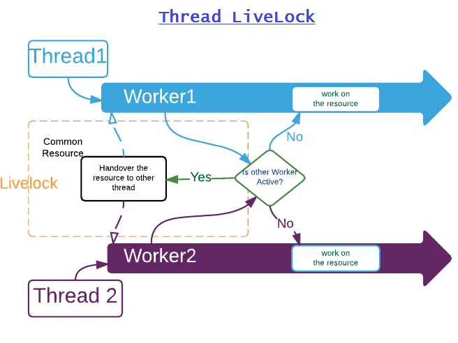

###线程活锁

活锁指的是任务或者执行者没有被阻塞，由于某些条件没有满足，导致一直重复尝试，失败，尝试，失败。 

活锁和死锁的区别在于，处于活锁的实体是在不断的改变状态，所谓的“活”， 而处于死锁的实体表现为等待；活锁有可能自行解开，死锁则不能。

**活锁的例子:**

-  单一实体的活锁

例如线程从队列中拿出一个任务来执行，如果任务执行失败，那么将任务重新加入队列，继续执行。假设任务总是执行失败，或者某种依赖的条件总是不满足，那么线程一直在繁忙却没有任何结果。

-  协同导致的活锁

生活中的典型例子：马路中间有条小桥，只能容纳一辆车经过，桥两头开来两辆车A和B，A比较礼貌，示意B先过，B也比较礼貌，示意A先过，结果两人一直谦让谁也过不去。

计算机中的例子：两个线程发生了某些条件的碰撞后重新执行，那么如果再次尝试后依然发生了碰撞，长此下去就有可能发生活锁。

**示例代码：**
	
	public class Livelock {
	
		public static void main(String[] args) {
			final Worker worker1 = new Worker("Worker 1 ", true);
			final Worker worker2 = new Worker("Worker 2", true);
	
			final CommonResource s = new CommonResource(worker1);
	
			new Thread(() -> {
				worker1.work(s, worker2);
			}).start();
	
			new Thread(() -> {
				worker2.work(s, worker1);
			}).start();
		}
	}
	//////////////////////////////////////////////////////////////
	class Worker {
		private String name;
		private boolean active;
	
		public Worker(String name, boolean active) {
			this.name = name;
			this.active = active;
		}
	
		public String getName() {
			return name;
		}
	
		public boolean isActive() {
			return active;
		}
	
		public synchronized void work(CommonResource commonResource, Worker otherWorker) {
			while (active) {
				// wait for the resource to become available.
				if (commonResource.getOwner() != this) {
					try {
						wait(10);
					} catch (InterruptedException e) {
						// ignore
					}
					continue;
				}
	
				// If other worker is also active let it do it's work first
				if (otherWorker.isActive()) {
					System.out.println(getName() + " : handover the resource to the worker " + otherWorker.getName());
					commonResource.setOwner(otherWorker);
					continue;
				}
	
				// now use the commonResource
				System.out.println(getName() + ": working on the common resource");
				active = false;
				commonResource.setOwner(otherWorker);
			}
		}
	}
	////////////////////////////////////////////////////////////////
	class CommonResource {
		private Worker owner;
	
		public CommonResource(Worker d) {
			owner = d;
		}
	
		public Worker getOwner() {
			return owner;
		}
	
		public synchronized void setOwner(Worker d) {
			owner = d;
		}
	}

输出:
不会结束的重复打印下去:

	Worker 1  : handing over the resource to the worker: Worker 2
	Worker 2 : handing over the resource to the worker: Worker 1
	Worker 1  : handing over the resource to the worker: Worker 2
	Worker 2 : handing over the resource to the worker: Worker 1
	Worker 1  : handing over the resource to the worker: Worker 2
	Worker 2 : handing over the resource to the worker: Worker 1
	    ........

解决协同活锁的一种方案是调整重试机制。

比如引入一些随机性。例如如果检测到冲突，那么就暂停随机的一定时间进行重试。这回大大减少碰撞的可能性。

另外为了避免可能的死锁，适当加入一定的重试次数也是有效的解决办法。

 

