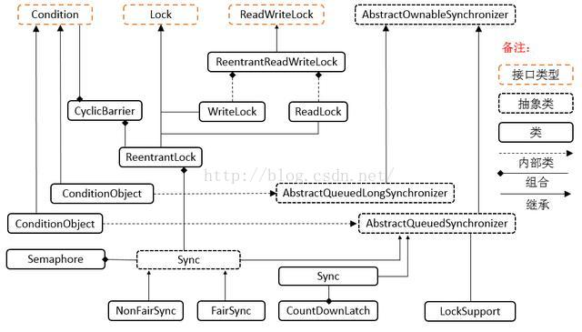

## 并发新特性—Lock 锁与条件变量 ##

####  一、简单使用 Lock 锁

　　Java 5 中引入了新的锁机制——java.util.concurrent.locks 中的显式的互斥锁：Lock 接口，它提供了比synchronized 更加广泛的锁定操作。  
　　Lock 接口有 3 个实现它的类：ReentrantLock、ReentrantReadWriteLock.ReadLock 和 ReentrantReadWriteLock.WriteLock，即重入锁、读锁和写锁。

　　

- lock 必须被显式地创建、锁定和释放。
- 为了保证锁一定被被释放，防止死锁的发生（可能会有异常发生），要把互斥区放在 try 语句块内，并在 finally 语句块中释放锁，以确保 unlock()不会过早发生，从而将数据暴露给第二个任务。
- 因此，采用 lock 加锁和释放锁的一般形式如下：

		Lock lock = new ReentrantLock();// 默认使用非公平锁，如果要使用公平锁，需要传入参数true
		 ........
		lock.lock();
		try {
			// 更新对象的状态
			// 捕获异常，必要时恢复到原来的不变约束
			// 如果有return语句，放在这里
		} finally {
			lock.unlock(); // 锁必须在finally块中释放
		}

**常用方法**：

- lock()方法是用来获取锁。如果锁已被其他线程获取，则进行等待。
- tryLock()方法是有返回值的，它表示用来尝试获取锁，如果获取成功，则返回true，如果获取失败（即锁已被其他线程获取），则返回false，也就说这个方法无论如何都会立即返回。在拿不到锁时不会一直在那等待。
- tryLock(long time, TimeUnit unit)方法和tryLock()方法是类似的，只不过区别在于这个方法在拿不到锁时会等待一定的时间，在时间期限之内如果还拿不到锁，就返回false。如果如果一开始拿到锁或者在等待期间内拿到了锁，则返回true。
- lockInterruptibly()方法比较特殊，当通过这个方法去获取锁时，如果线程正在等待获取锁，则这个线程能够响应中断，即中断线程的等待状态。也就使说，当两个线程同时通过lock.lockInterruptibly()想获取某个锁时，假若此时线程A获取到了锁，而线程B只有在等待，那么对线程B调用threadB.interrupt()方法能够中断线程B的等待过程。

#### 二、 ReetrankLock 与 synchronized 比较

　　1）Lock是一个接口，而synchronized是Java中的关键字，synchronized是内置的语言实现；

　　2）synchronized在发生异常时，会自动释放线程占有的锁，因此不会导致死锁现象发生；而Lock在发生异常时，如果没有主动通过unLock()去释放锁，则很可能造成死锁现象，因此使用Lock时需要在finally块中释放锁；

　　3）Lock可以让等待锁的线程响应中断，而synchronized却不行，使用synchronized时，等待的线程会一直等待下去，不能够响应中断；

　　4）通过Lock可以知道有没有成功获取锁，而synchronized却无法办到。

　　5）可实现公平锁。

　　多个线程在等待同一个锁时，必须按照申请锁的时间顺序排队等待，而非公平锁则不保证这点，在锁释放时，任何一个等待锁的线程都有机会获得锁。synchronized 中的锁时非公平锁，ReentrantLock 默认情况下也是非公平锁，但可以通过构造方法 ReentrantLock（ture）来要求使用公平锁。

　　6）锁可以绑定多个条件。

　　　ReentrantLock 对象可以同时绑定多个 Condition 对象（名曰：条件变量或条件队列），而在 synchronized 中，锁对象的 wait()和 notify()或 notifyAll()方法可以实现一个隐含条件，但如果要和多于一个的条件关联的时候，就不得不额外地添加一个锁，而 ReentrantLock 则无需这么做，只需要多次调用 newCondition()方法即可。而且我们还可以通过绑定 Condition 对象来判断当前线程通知的是哪些线程（即与 Condition 对象绑定在一起的其他线程）。

　　7）Lock可以提高多个线程进行读操作的效率。

　　在性能上来说，如果竞争资源不激烈，两者的性能是差不多的，而当竞争资源非常激烈时（即有大量线程同时竞争），此时Lock的性能要远远优于synchronized。所以说，在具体使用时要根据适当情况选择。

使用 ReentrantLock 的最佳时机：
当你需要以下高级特性时，才应该使用：可定时的、可轮询的与可中断的锁获取操作，公平队列，或者非块结构的锁。否则，请使用 synchronized。

####  可中断锁
ReetrantLock 有两种锁：忽略中断锁和响应中断锁。忽略中断锁与 synchronized 实现的互斥锁一样，不能响应中断，而响应中断锁可以响应中断。

如果某一线程 A 正在执行锁中的代码，另一线程B正在等待获取该锁，可能由于等待时间过长，线程 B 不想等待了，想先处理其他事情，我们可以让它中断自己或者在别的线程中中断它，如果此时 ReetrantLock 提供的是忽略中断锁，则它不会去理会该中断，而是让线程B继续等待，而如果此时 ReetrantLock 提供的是响应中断锁，那么它便会处理中断，让线程 B 放弃等待，转而去处理其他事情。

获得响应中断锁的一般形式如下：

	public class Buffer {
	
		private Object lock;
	
		public Buffer() {
			lock = this;
		}
	
		public void write() {
			synchronized (lock) {
				long startTime = System.currentTimeMillis();
				System.out.println("开始往这个buff写入数据…");
				for (;;)// 模拟要处理很长时间
				{
					if (System.currentTimeMillis() - startTime > Integer.MAX_VALUE) {
						break;
					}
				}
				System.out.println("终于写完了");
			}
		}
	
		public void read() {
			synchronized (lock) {
				System.out.println("从这个buff读数据");
			}
		}
	
		public static void main(String[] args) {
			Buffer buff = new Buffer();
	
			final Writer writer = new Writer(buff);
			final Reader reader = new Reader(buff);
	
			writer.start();
			reader.start();
	
			new Thread(new Runnable() {
	
				@Override
				public void run() {
					long start = System.currentTimeMillis();
					for (;;) {
						// 等5秒钟去中断读
						if (System.currentTimeMillis() - start > 5000) {
							System.out.println("不等了，尝试中断");
							reader.interrupt(); // 尝试中断读线程
							break;
						}
	
					}
	
				}
			}).start();
			// 我们期待“读”这个线程能退出等待锁，可是事与愿违，一旦读这个线程发现自己得不到锁，
			// 就一直开始等待了，就算它等死，也得不到锁，因为写线程要21亿秒才能完成 T_T ，即使我们中断它，
			// 它都不来响应下，看来真的要等死了。这个时候，ReentrantLock给了一种机制让我们来响应中断，
			// 让“读”能伸能屈，勇敢放弃对这个锁的等待。我们来改写Buffer这个类，就叫BufferInterruptibly吧，可中断缓存。
		}
	}
	
	class Writer extends Thread {
	
		private Buffer buff;
	
		public Writer(Buffer buff) {
			this.buff = buff;
		}
	
		@Override
		public void run() {
			buff.write();
		}
	}
	
	class Reader extends Thread {
	
		private Buffer buff;
	
		public Reader(Buffer buff) {
			this.buff = buff;
		}
	
		@Override
		public void run() {
	
			buff.read();// 这里估计会一直阻塞
	
			System.out.println("读结束");
	
		}
	}
执行结果如下：
	
	开始往这个buff写入数据…
	不等了，尝试中断

我们等待了很久，后面依然没有输出，说明读线程对互斥锁的等待并没有被中断，也就是该户吃锁没有响应对读线程的中断。

我们再将上面代码中 synchronized 的互斥锁改为 ReentrantLock 的响应中断锁，即改为如下代码：

	import java.util.concurrent.locks.ReentrantLock;
	
	public class BufferInterruptibly {
	
		private ReentrantLock lock = new ReentrantLock();
	
		public void write() {
			lock.lock();
			try {
				long startTime = System.currentTimeMillis();
				System.out.println("开始往这个buff写入数据…");
				for (;;)// 模拟要处理很长时间
				{
					if (System.currentTimeMillis() - startTime > Integer.MAX_VALUE) {
						break;
					}
				}
				System.out.println("终于写完了");
			} finally {
				lock.unlock();
			}
		}
	
		public void read() throws InterruptedException {
			lock.lockInterruptibly();// 注意这里，可以响应中断
			try {
				System.out.println("从这个buff读数据");
			} finally {
				lock.unlock();
			}
		}
	
		public static void main(String args[]) {
			BufferInterruptibly buff = new BufferInterruptibly();
	
			final Writer2 writer = new Writer2(buff);
			final Reader2 reader = new Reader2(buff);
	
			writer.start();
			reader.start();
	
			new Thread(new Runnable() {
	
				@Override
				public void run() {
					long start = System.currentTimeMillis();
					for (;;) {
						if (System.currentTimeMillis() - start > 5000) {
							System.out.println("不等了，尝试中断");
							reader.interrupt(); // 此处中断读操作
							break;
						}
					}
				}
			}).start();
	
		}
	}
	
	class Reader2 extends Thread {
	
		private BufferInterruptibly buff;
	
		public Reader2(BufferInterruptibly buff) {
			this.buff = buff;
		}
	
		@Override
		public void run() {
	
			try {
				buff.read();// 可以收到中断的异常，从而有效退出
			} catch (InterruptedException e) {
				System.out.println("我不读了");
			}
	
			System.out.println("读结束");
	
		}
	}
	
	class Writer2 extends Thread {
	
		private BufferInterruptibly buff;
	
		public Writer2(BufferInterruptibly buff) {
			this.buff = buff;
		}
	
		@Override
		public void run() {
			buff.write();
		}
	
	}

执行结果如下：

	开始往这个buff写入数据…
	不等了，尝试中断
	我不读了
	读结束

从结果中可以看出，尝试中断后输出了 catch 语句块中的内容，也输出了后面的“读结束”，说明线程对互斥锁的等待被中断了，也就是该互斥锁响应了对读线程的中断。

####  条件变量实现线程间协作
在生产者——消费者模型一文中，我们用 synchronized 实现互斥，并配合使用 Object 对象的 wait（）和 notify()或 notifyAll()方法来实现线程间协作。Java 5 之后，我们可以用 Reentrantlock 锁配合 Condition 对象上的 await()和 signal()或 signalAll()方法来实现线程间协作。在 ReentrantLock 对象上 newCondition()可以得到一个 Condition 对象，可以通过在 Condition 上调用 await()方法来挂起一个任务（线程），通过在 Condition 上调用 signal()来通知任务，从而唤醒一个任务，或者调用 signalAll()来唤醒所有在这个 Condition 上被其自身挂起的任务。另外，如果使用了公平锁，signalAll()的与 Condition 关联的所有任务将以 FIFO 队列的形式获取锁，如果没有使用公平锁，则获取锁的任务是随机的，这样我们便可以更好地控制处在 await 状态的任务获取锁的顺序。与 notifyAll()相比，signalAll()是更安全的方式。另外，它可以指定唤醒与自身 Condition 对象绑定在一起的任务。

下面将生产者——消费者模型一文中的代码改为用条件变量实现，如下：

	
	import java.util.concurrent.locks.Condition;
	import java.util.concurrent.locks.Lock;
	import java.util.concurrent.locks.ReentrantLock;
	
	class Info { // 定义信息类
		private String name = "name";// 定义name属性，为了与下面set的name属性区别开
		private String content = "content";// 定义content属性，为了与下面set的content属性区别开
		private boolean flag = true; // 设置标志位,初始时先生产
		private Lock lock = new ReentrantLock();
		private Condition condition = lock.newCondition(); // 产生一个Condition对象
	
		public void set(String name, String content) {
			lock.lock();
			try {
				while (!flag) {
					condition.await();
				}
				this.setName(name); // 设置名称
				Thread.sleep(300);
				this.setContent(content); // 设置内容
				flag = false; // 改变标志位，表示可以取走
				condition.signal();
			} catch (InterruptedException e) {
				e.printStackTrace();
			} finally {
				lock.unlock();
			}
		}
	
		public void get() {
			lock.lock();
			try {
				while (flag) {
					condition.await();
				}
				Thread.sleep(300);
				System.out.println(this.getName() + " --> " + this.getContent());
				flag = true; // 改变标志位，表示可以生产
				condition.signal();
			} catch (InterruptedException e) {
				e.printStackTrace();
			} finally {
				lock.unlock();
			}
		}
	
		public void setName(String name) {
			this.name = name;
		}
	
		public void setContent(String content) {
			this.content = content;
		}
	
		public String getName() {
			return this.name;
		}
	
		public String getContent() {
			return this.content;
		}
	}
	
	class Producer implements Runnable { // 通过Runnable实现多线程
		private Info info = null; // 保存Info引用
	
		public Producer(Info info) {
			this.info = info;
		}
	
		public void run() {
			boolean flag = true; // 定义标记位
			for (int i = 0; i < 10; i++) {
				if (flag) {
					this.info.set("姓名--1", "内容--1"); // 设置名称
					flag = false;
				} else {
					this.info.set("姓名--2", "内容--2"); // 设置名称
					flag = true;
				}
			}
		}
	}
	
	class Consumer implements Runnable {
		private Info info = null;
	
		public Consumer(Info info) {
			this.info = info;
		}
	
		public void run() {
			for (int i = 0; i < 10; i++) {
				this.info.get();
			}
		}
	}
	
	public class ThreadCaseDemo {
		public static void main(String args[]) {
			Info info = new Info(); // 实例化Info对象
			Producer pro = new Producer(info); // 生产者
			Consumer con = new Consumer(info); // 消费者
			new Thread(pro).start();
			// 启动了生产者线程后，再启动消费者线程
			try {
				Thread.sleep(500);
			} catch (InterruptedException e) {
				e.printStackTrace();
			}
	
			new Thread(con).start();
		}
	}
 
执行后，同样可以得到如下的结果：

	姓名--1 --> 内容--1
	姓名--2 --> 内容--2
	姓名--1 --> 内容--1
	姓名--2 --> 内容--2
	姓名--1 --> 内容--1
	姓名--2 --> 内容--2
	姓名--1 --> 内容--1
	姓名--2 --> 内容--2
	姓名--1 --> 内容--1
	姓名--2 --> 内容--2
从以上并不能看出用条件变量的 await()、signal()、signalAll()方法比用 Object 对象的 wait()、notify()、notifyAll()方法实现线程间协作有多少优点，但它在处理更复杂的多线程问题时，会有明显的优势。所以，Lock 和 Condition 对象只有在更加困难的多线程问题中才是必须的。

####  读写锁
另外，synchronized 获取的互斥锁不仅互斥读写操作、写写操作，还互斥读读操作，而读读操作时不会带来数据竞争的，因此对对读读操作也互斥的话，会降低性能。Java 5 中提供了读写锁，它将读锁和写锁分离，使得读读操作不互斥，获取读锁和写锁的一般形式如下：

	ReadWriteLock rwl = new ReentrantReadWriteLock();      
	rwl.writeLock().lock()  //获取写锁  
	rwl.readLock().lock()  //获取读锁  
用读锁来锁定读操作，用写锁来锁定写操作，这样写操作和写操作之间会互斥，读操作和写操作之间会互斥，但读操作和读操作就不会互斥。

**案例：**缓存功能模拟

	
	import java.util.HashMap;
	import java.util.Map;
	import java.util.concurrent.locks.ReadWriteLock;
	import java.util.concurrent.locks.ReentrantReadWriteLock;
	
	public class CacheDemo {
		private Map<String, Object> map = new HashMap<String, Object>();// 缓存器
		private ReadWriteLock rwl = new ReentrantReadWriteLock();
	
		public static void main(String[] args) {
	
		}
	
		public Object get(String id) {
			Object value = null;
			rwl.readLock().lock();// 首先开启读锁，从缓存中去取
			try {
				value = map.get(id);
				if (value == null) { // 如果缓存中没有释放读锁，上写锁
					rwl.readLock().unlock();
					rwl.writeLock().lock();
					try {
						if (value == null) {
							value = "aaa"; // 此时可以去数据库中查找，这里简单的模拟一下
						}
					} finally {
						rwl.writeLock().unlock(); // 释放写锁
					}
					rwl.readLock().lock(); // 然后再上读锁
				}
			} finally {
				rwl.readLock().unlock(); // 最后释放读锁
			}
			return value;
		}
	
	}

参考：

http://www.ibm.com/developerworks/cn/java/j-jtp10264/index.html

http://wiki.jikexueyuan.com/project/java-concurrency/queue-stack.html