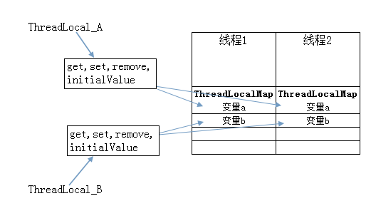
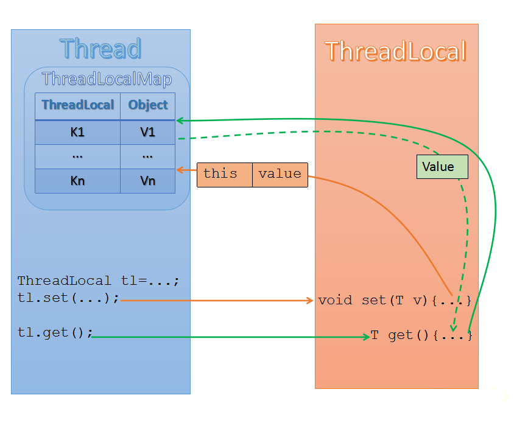

##线程局部变量 ThreadLocal ##

- **简介**

	ThreadLocal类为每一个线程都维护了自己独有的变量拷贝，所以一个线程对资源的修改，不影响另一个线程的运行。

	每个线程在访问该变量时，读取和修改的，都是自己独有的那一份变量拷贝，变量被彻底封闭在每个访问的线程中，并发错误出现的可能也完全消除了。这是一种以空间来换取线程安全性的策略。

	每个线程都拥有了自己独立的一个变量，竞争条件被彻底消除了，那就没有任何必要对这些线程进行同步，它们也能最大限度的由CPU调度，并发执行。

- **ThreadLocal使用方法：**

	ThreadLocal对外提供了4个方法， 他们的作用如下：

	**protected T initialValue()** : 用来设置ThreadLocal的初始值,该方法在调用get的时候会第一次被调用，但是如果一开始就调用了set，则该方法不会被调用。通常该方法只会被调用一次，除非手动调用了remove方法之后又调用get方法，这种情况下，get方法中还是会调用initialValue方法。该方法是protected类型的，很显然是建议在子类重载该方法的，所以通常该方法都会以匿名内部类的形式被重载，以指定初始值，比如

		public class TestThreadLocal {
		    private static final ThreadLocal<Integer> value = new ThreadLocal<Integer>() {
		        @Override
		        protected Integer initialValue() {
		            return Integer.valueOf(1);
		        }
		    };
		}

	**public T get()** ： 用来获取与当前线程关联的ThreadLocal的值，如果当前线程没有该ThreadLocal的值，它将被initialValue方法初始化。

	**public void set(T value)** ： 设置当前线程的该ThreadLocal的值。

	**public void remove()** ： 用来将当前线程的ThreadLocal绑定的值删除，在某些情况下需要手动调用该方法，**防止内存泄露**。

- **ThreadLocal原理：**

	每个Thread都有自己独立的ThreadLocalMap对象，用来存放各自独立的对象集合。

	在ThreadLocalMap中是以ThreadLocal作为key存储的，所以一个ThreadLocal代表一个隔离变量。

	我们无法直接操纵ThreadLocalMap对象，只能通过ThreadLocal对象用来维护ThreadLocalMap中的变量。

	示意图：

	

    **ThreadLocal数据读取和设置过程：**

	下图中绿色部分就是读取数据过程，橙色就是设置数据过程。

	

- **应用场景举例一、**

	SimpleDateFormat线程不安全问题的解决：使用ThreadLocal，为每个线程创建不同的DateFormat实例变量。

	原因：

	SimpleDateFormat(下面简称sdf)类内部有一个Calendar对象引用,它用来储存和这个sdf相关的日期信息,例如sdf.parse(dateStr)，sdf.format(date) 诸如此类的方法参数传入的日期相关String, Date等等, 都是交给Calendar引用来储存的.这样就会导致一个问题, 如果多个thread 之间就会共享这个sdf, 同时也是共享这个Calendar引用， 并且，观察 sdf.parse() 方法,你会发现有如下的调用:

		Date parse() {
		  calendar.clear(); // 清理calendar
		  ... // 执行一些操作, 设置 calendar 的日期什么的
		  calendar.getTime(); // 获取calendar的时间
		}

	这里会导致的问题就是，如果，线程A 调用了 sdf.parse()，并且进行了 calendar.clear()后还未执行calendar.getTime()的时候,线程B又调用了sdf.parse(), 这时候线程B也执行了sdf.clear()方法，这样就导致线程A的的calendar数据被清空了(实际上A,B的同时被清空了)。 又或者当 A 执行了calendar.clear() 后被挂起，这时候B 开始调用sdf.parse()并顺利结束, 这样 A 的 calendar内存储的的date 变成了后来B设置的calendar的date。

- **代码示例**
		

		public class DateUtil {
		
			private final static ThreadLocal<SimpleDateFormat> threadLocal = new ThreadLocal<SimpleDateFormat>() {
				protected SimpleDateFormat initialValue() {
					return new SimpleDateFormat("dd/MM/yyyy");
				}
			};
		
			public String formatDate(Date input) {
				if (input == null) {
					return null;
				}
		
				return threadLocal.get().format(input);
			}
		}

- **应用场景举例二、**

	下面的类为每个线程生成不同的ID，当某个线程第一次调用Thread.get()时，会为该线程赋予一个ID，并且在后续的调用中不再改变。
	
		 import java.util.concurrent.atomic.AtomicInteger;
		
		 public class ThreadId {
		     // Atomic integer containing the next thread ID to be assigned
		     private static final AtomicInteger nextId = new AtomicInteger(0);
		
		     // Thread local variable containing each thread's ID
		     private static final ThreadLocal<Integer> threadId =
		         new ThreadLocal<Integer>() {
		             @Override protected Integer initialValue() {
		                 return nextId.getAndIncrement();
		         }
		     };
		
		     // Returns the current thread's unique ID, assigning it if necessary
		     public static int get() {
		         return threadId.get();
		     }
		 }

- **应用场景举例三、**

	hibernate的工具类

		public class HibernateUtil {
			private static Log log = LogFactory.getLog(HibernateUtil.class);
			private static final SessionFactory sessionFactory; // 定义SessionFactory
		
			static {
				try {
					// 通过默认配置文件hibernate.cfg.xml创建SessionFactory
					sessionFactory = new Configuration().configure().buildSessionFactory();
				} catch (Throwable ex) {
					log.error("初始化SessionFactory失败！", ex);
					throw new ExceptionInInitializerError(ex);
				}
			}
		
			// 创建线程局部变量session，用来保存Hibernate的Session
			private static final ThreadLocal session = new ThreadLocal();
		
			/**
			 * 获取当前线程中的Session
			 * 
			 * @return Session
			 * @throws HibernateException
			 */
			public static Session currentSession() throws HibernateException {
				Session s = (Session) session.get();
				// 如果Session还没有打开，则新开一个Session
				if (s == null) {
					s = sessionFactory.openSession();
					session.set(s); // 将新开的Session保存到线程局部变量中
				}
				return s;
			}
		
			public static void closeSession() throws HibernateException {
				// 获取线程局部变量，并强制转换为Session类型
				Session s = (Session) session.get();
				session.set(null);
				if (s != null)
					s.close();
			}
		}

- **应用场景举例四、**

	使用ThreadLocal在线程内隔离访问数据对象，基本步骤如下：
	
	1、在多线程的类（如ThreadDemo类）中，创建一个ThreadLocal对象threadXxx，用来保存线程间需要隔离处理的对象xxx。   
	2、在ThreadDemo类中，创建一个获取要隔离访问的数据的方法getXxx()，在方法中判断，若ThreadLocal对象为null时候，应该new()一个隔离访问类型的对象，并强制转换为要应用的类型。   
	3、在ThreadDemo类的run()方法中，通过调用getXxx()方法获取要操作的数据，这样可以保证每个线程对应一个数据对象，在任何时刻都操作的是这个对象。 

		
		import java.util.Random;
		
		public class ThreadLocalTest implements Runnable {
		
			ThreadLocal<Studen> studenThreadLocal = new ThreadLocal<Studen>();
		
			@Override
			public void run() {
				String currentThreadName = Thread.currentThread().getName();
				System.out.println(currentThreadName + " is running...");
				Random random = new Random();
				int age = random.nextInt(100);
				System.out.println(currentThreadName + " is set age: " + age);
				Studen studen = getStudent(); // 通过这个方法，为每个线程都独立的new一个student对象，每个线程的的student对象都可以设置不同的值
				studen.setAge(age);
				System.out.println(currentThreadName + " is first get age: " + studen.getAge());
				try {
					Thread.sleep(500);
				} catch (InterruptedException e) {
					e.printStackTrace();
				}
				System.out.println(currentThreadName + " is second get age: " + studen.getAge());
		
			}
		
			private Studen getStudent() {
				Studen studen = studenThreadLocal.get();
				if (null == studen) {
					studen = new Studen();
					studenThreadLocal.set(studen);
				}
				return studen;
			}
		
			public static void main(String[] args) {
				ThreadLocalTest t = new ThreadLocalTest();
				Thread t1 = new Thread(t, "Thread A");
				Thread t2 = new Thread(t, "Thread B");
				t1.start();
				t2.start();
			}
		
		}
		
		class Studen {
			int age;
		
			public int getAge() {
				return age;
			}
		
			public void setAge(int age) {
				this.age = age;
			}
		
		}

参考：

http://blog.csdn.net/vking_wang/article/details/14225379  
http://blog.csdn.net/vking_wang/article/details/13168743  
https://www.zybuluo.com/pastqing/note/178783  
http://blog.csdn.net/coslay/article/details/38293689    
http://www.cnblogs.com/DajiangDev/p/3542543.html

