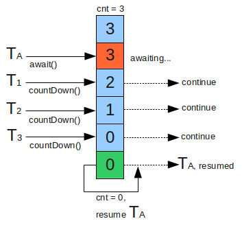

## Java并发工具类 - 等待多线程完成的 CountDownLatch ##

- **简介**

	在一些应用场合中，某段程序需要等待某个条件达到要求后才能执行，或者等待一定长的时间后执行，CountDownLatch类是一个**同步倒数计数器**,构造时传入int参数,该参数就是计数器的初始值，每调用一次countDown()方法，计数器减1,计数器大于0 时，await()方法会阻塞后面程序执行，直到计数器为0。

	

- **CountDownLatch 的使用：**

	public void await() throws InterruptedException { };   //调用await()方法的线程会被挂起，它会等待直到count值为0才继续执行
	
	public boolean await(long timeout, TimeUnit unit) throws InterruptedException { };  //和await()类似，只不过等待一定的时间后count值还没变为0的话就会继续执行

	public void countDown() { };  //将count值减1

- **应用场景举例**

	 举个例子，有三个工人在为老板干活，这个老板有一个习惯，就是当三个工人把一天的活都干完了的时候，他就来检查所有工人所干的活。

- **代码示例**
	
		import java.util.Random;
		import java.util.concurrent.CountDownLatch;
		import java.util.concurrent.ExecutorService;
		import java.util.concurrent.Executors;
		import java.util.concurrent.TimeUnit;
		
		public class CountDownLatchTest {
		
			public static void main(String[] args) {
				ExecutorService executor = Executors.newCachedThreadPool();
		
				CountDownLatch latch = new CountDownLatch(3);
		
				Worker w1 = new Worker(latch, "张三");
				Worker w2 = new Worker(latch, "李四");
				Worker w3 = new Worker(latch, "王五");
		
				Boss boss = new Boss(latch);
		
				executor.execute(w3);
				executor.execute(w2);
				executor.execute(w1);
				executor.execute(boss);
		
				executor.shutdown();
			}
		}
		//工人
		class Worker implements Runnable {
			private CountDownLatch downLatch;
			private String name;
		
			public Worker(CountDownLatch downLatch, String name) {
				this.downLatch = downLatch;
				this.name = name;
			}
		
			public void run() {
				this.doWork();
				try {
					TimeUnit.SECONDS.sleep(new Random().nextInt(10));
				} catch (InterruptedException ie) {
				}
				System.out.println("---------------" + this.name + "活干完了！");
				this.downLatch.countDown();
		
			}
		
			private void doWork() {
				System.out.println(this.name + "正在干活!");
			}
		
		}
		//老板
		class Boss implements Runnable {
			private CountDownLatch downLatch;
		
			public Boss(CountDownLatch downLatch) {
				this.downLatch = downLatch;
			}
		
			public void run() {
				System.out.println("老板正在等所有的工人干完活......");
				try {
					this.downLatch.await();
				} catch (InterruptedException e) {
				}
				System.out.println("工人活都干完了，老板开始检查了！");
			}
		
		}
	

- **输出**

		王五正在干活!
		李四正在干活!
		张三正在干活!
		老板正在等所有的工人干完活......
		---------------王五活干完了！
		---------------张三活干完了！
		---------------李四活干完了！
		工人活都干完了，老板开始检查了！

	
 
- **拓展**

		import java.util.Random;
		import java.util.concurrent.CountDownLatch;
		
		public class TestCountDownLatch {
			private static final int RUNNER_NUMBER = 5; // 运动员个数
			private static final Random RANDOM = new Random();
		
			public static void main(String[] args) {
				// 用于判断发令之前运动员是否已经完全进入准备状态，需要等待5个运动员，所以参数为5
				CountDownLatch readyLatch = new CountDownLatch(RUNNER_NUMBER);
				// 用于判断裁判是否已经发令，只需要等待一个裁判，所以参数为1
				CountDownLatch startLatch = new CountDownLatch(1);
				for (int i = 0; i < RUNNER_NUMBER; i++) {
					Thread t = new Thread(new Runner((i + 1) + "号运动员", readyLatch, startLatch));
					t.start();
				}
				try {
					readyLatch.await();
				} catch (InterruptedException e) {
					e.printStackTrace();
				}
				startLatch.countDown();
				System.out.println("裁判：所有运动员准备完毕，开始...");
			}
		
			static class Runner implements Runnable {
				private CountDownLatch readyLatch;
				private CountDownLatch startLatch;
				private String name;
		
				public Runner(String name, CountDownLatch readyLatch, CountDownLatch startLatch) {
					this.name = name;
					this.readyLatch = readyLatch;
					this.startLatch = startLatch;
				}
		
				public void run() {
					int readyTime = RANDOM.nextInt(1000);
					System.out.println(name + "：我需要" + readyTime + "秒时间准备.");
					try {
						Thread.sleep(readyTime);
					} catch (InterruptedException e) {
						e.printStackTrace();
					}
					System.out.println(name + "：我已经准备完毕.");
					readyLatch.countDown();
					try {
						startLatch.await(); // 等待裁判发开始命令
					} catch (InterruptedException e) {
						e.printStackTrace();
					}
					System.out.println(name + "：开跑...");
				}
			}
		}

	
	输出：
	
		1号运动员：我需要666秒时间准备.
		5号运动员：我需要949秒时间准备.
		2号运动员：我需要164秒时间准备.
		3号运动员：我需要132秒时间准备.
		4号运动员：我需要605秒时间准备.
		3号运动员：我已经准备完毕.
		2号运动员：我已经准备完毕.
		4号运动员：我已经准备完毕.
		1号运动员：我已经准备完毕.
		5号运动员：我已经准备完毕.
		裁判：所有运动员准备完毕，开始...
		3号运动员：开跑...
		2号运动员：开跑...
		4号运动员：开跑...
		1号运动员：开跑...
		5号运动员：开跑...

