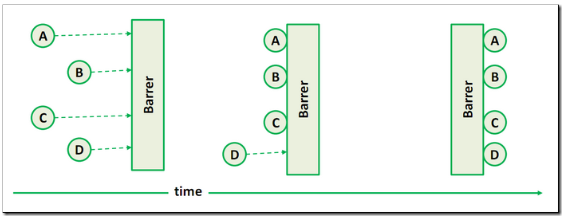

## Java并发工具类 - 回环栅栏 CyclicBarrier ##

- **简介**

	CyclicBarrier 的字面意思是可循环使用（Cyclic）的屏障（Barrier）。它要做的事情是，让一组线程到达一个屏障（也可以叫同步点）时被阻塞，直到最后一个线程到达屏障时，屏障才会开门，所有被屏障拦截的线程才会继续干活。

	举个简单的例子就是:旅游团带着一帮人参观景点,规定在下一个景点A处集合,于是导游就在景点A等着大家,导游就是这个集合点或者说屏障,直到所有的游客集合完毕,导游才会带着大家继续参观下一个景点B.

- **CyclicBarrier的使用**

	CyclicBarrier有两个构造函数:

	CyclicBarrier(int parties); int类型的参数表示有几个线程来参与这个屏障拦截,(拿上面的例子,即有几个人跟团旅游);

	CyclicBarrier(int parties,Runnable barrierAction);当所有线程到达一个屏障点时,优先执行barrierAction这个线程.

	最重要的一个方法:

	await();每个线程调用await(),表示我已经到达屏障点,然后当前线程被阻塞,(拿上面的例子讲就是游客A表示到达了景点A,然后他就在那儿等着大家到齐).

- **应用场景举例**

	有几个同学约好一起去食堂吃饭，各自都从各自的宿舍出发，然后到宿舍楼下集合。当所有的人都到了宿舍楼下之后，再一起从宿舍楼下出发前往食堂吃饭。

- **代码示例**

				
		
		import java.util.Random;
		import java.util.concurrent.CyclicBarrier;
		
		public class CyclicBarrierTest {
			private static final int THREAD_NUMBER = 5;
			private static final Random RANDOM = new Random();
		
			public static void main(String[] args) throws Exception {
				CyclicBarrier barrier = new CyclicBarrier(THREAD_NUMBER, new Runnable() {
					public void run() {
						System.out.println("barrierAction：我宣布，所有小伙伴写入数据完毕");
					}
				});
				for (int i = 1; i <= THREAD_NUMBER; i++) {
					Thread t = new Thread(new Worker(i, barrier));
					t.start();
				}
				Thread.sleep(5000);
				System.out.println("================barrier重用==========================");
				for (int i = 1; i <= THREAD_NUMBER; i++) {
					Thread t = new Thread(new Worker(i, barrier));
					t.start();
				}
			}
		
			static class Worker implements Runnable {
				private CyclicBarrier barrier;
				int id;
		
				public Worker(int id, CyclicBarrier barrier) {
					this.barrier = barrier;
					this.id = id;
				}
		
				public void run() {
					int time = RANDOM.nextInt(1000);
					System.out.println("任务" + id + "：我需要" + time + "毫秒时间写入数据.");
					try {
						Thread.sleep(time);
					} catch (InterruptedException e) {
						e.printStackTrace();
					}
					System.out.println("任务" + id + "：写入数据完毕，等待其他小伙伴...");
					try {
						barrier.await(); // 等待所有线程都调用过此函数才能进行后续动作
					} catch (Exception e) {
						e.printStackTrace();
					}
					System.out.println("任务" + id + "：所有线程都写入数据完毕，继续干活...");
				}
			}
		}

- **输出**

		任务1：我需要219毫秒时间写入数据.
		任务4：我需要655毫秒时间写入数据.
		任务2：我需要450毫秒时间写入数据.
		任务3：我需要745毫秒时间写入数据.
		任务5：我需要7毫秒时间写入数据.
		任务5：写入数据完毕，等待其他小伙伴...
		任务1：写入数据完毕，等待其他小伙伴...
		任务2：写入数据完毕，等待其他小伙伴...
		任务4：写入数据完毕，等待其他小伙伴...
		任务3：写入数据完毕，等待其他小伙伴...
		barrierAction：我宣布，所有小伙伴写入数据完毕
		任务3：所有线程都写入数据完毕，继续干活...
		任务2：所有线程都写入数据完毕，继续干活...
		任务5：所有线程都写入数据完毕，继续干活...
		任务1：所有线程都写入数据完毕，继续干活...
		任务4：所有线程都写入数据完毕，继续干活...
		================barrier重用==========================
		任务1：我需要311毫秒时间写入数据.
		任务3：我需要476毫秒时间写入数据.
		任务4：我需要821毫秒时间写入数据.
		任务2：我需要952毫秒时间写入数据.
		任务5：我需要52毫秒时间写入数据.
		任务5：写入数据完毕，等待其他小伙伴...
		任务1：写入数据完毕，等待其他小伙伴...
		任务3：写入数据完毕，等待其他小伙伴...
		任务4：写入数据完毕，等待其他小伙伴...
		任务2：写入数据完毕，等待其他小伙伴...
		barrierAction：我宣布，所有小伙伴写入数据完毕
		任务5：所有线程都写入数据完毕，继续干活...
		任务2：所有线程都写入数据完毕，继续干活...
		任务4：所有线程都写入数据完毕，继续干活...
		任务3：所有线程都写入数据完毕，继续干活...
		任务1：所有线程都写入数据完毕，继续干活...

- **CyclicBarrier和CountDownLatch的区别**

	CountDownLatch和CyclicBarrier都能够实现线程之间的等待，只不过它们侧重点不同：

	CountDownLatch一般用于某个线程A等待若干个其他线程执行完任务之后，它才执行；

	而CyclicBarrier一般用于一组线程互相等待至某个状态，然后这一组线程再同时执行；

	另外，CountDownLatch的计数器只能使用一次，不能够重用的。而CyclicBarrier的计数器可以重用，还可以使用reset() 方法重置。所以CyclicBarrier能处理更为复杂的业务场景，比如如果计算发生错误，可以重置计数器，并让线程们重新执行一次。

	CyclicBarrier还提供其他有用的方法，比如getNumberWaiting方法可以获得CyclicBarrier阻塞的线程数量。isBroken方法用来知道阻塞的线程是否被中断。比如以下代码执行完之后会返回true。

	**从关注点上来看**：
	
	使用CountDownLatch时，它关注的一个线程或者多个线程需要在其它在一组线程完成操作之后，在去做一些事情 。比如：服务的启动等。 
	
	CyclicBarrier更加关注的是公共的栅栏点(Common Barrier point),关注的是这个点上的同步。这个点之前之后的事情并不需要太多的关注。 比如：一个并行计算需要分几个阶段完成，在一个阶段完成进入到下一个阶段之前，需要同步，这时候CyclicBarrie很适合。 

	

