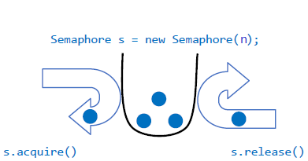

## Java并发工具类 - Semaphore ##

- **简介**

	Semaphore可以控制某个资源可被同时访问的个数，通过 acquire() 获取一个许可，如果没有就等待，而 release() 释放一个许可。比如在Windows下可以设置共享文件的最大客户端访问个数。 

	

	Semaphore可以用于做流量控制，特别公用资源有限的应用场景，比如数据库连接。假如有一个需求，要读取几万个文件的数据，因为都是IO密集型任务，我们可以启动几十个线程并发的读取，但是如果读到内存后，还需要存储到数据库中，而数据库的连接数只有10个，这时我们必须控制只有十个线程同时获取数据库连接保存数据，否则会报错无法获取数据库连接。这个时候，我们就可以使用Semaphore来做流控，

- **Semaphore 的使用**

	public Semaphore(int permits) //参数permits表示许可数目，即同时可以允许多少线程进行访问

	public Semaphore(int permits, boolean fair)  //这个多了一个参数fair表示是否是公平的，即等待时间越久的越先获取许可

	下面说一下Semaphore类中比较重要的几个方法，首先是acquire()、release()方法：
	
	public void acquire() throws InterruptedException {  }     //获取一个许可

	public void acquire(int permits) throws InterruptedException { }    //获取permits个许可

	public void release() { }          //释放一个许可

	public void release(int permits) { }    //释放permits个许可

- **应用场景举例**

	

	模拟银行窗口处理业务情景：同时有5个窗口处理业务，有20个顾客要办理业务；

	Semaphore实现的功能就类似银行网点有5个窗口处理业务，假如有20个人要办理业务，那么同时只能有5个人办理，当5个人中的任何一个人办理完成后，其中等待的另外15个人中可以是随机获得优先机会，也可以是按照先来后到的顺序获得机会，这取决于构造Semaphore对象时传入的参数选项。单个信号量的Semaphore对象可以实现互斥锁的功能，并且可以是由一个线程获得了“锁”，再由另一个线程释放“锁”。

- **代码示例一**

		import java.util.concurrent.ExecutorService;
		import java.util.concurrent.Executors;
		import java.util.concurrent.Semaphore;
		
		public class TestSemaphore {
		
			public static void main(String[] args) {
		
				// 构建线程池
				ExecutorService pool = Executors.newCachedThreadPool();
				// 同时有5个窗口处理业务
				final Semaphore semp = new Semaphore(5);
				// 有20个顾客要办理业务
				for (int i = 0; i < 20; i++) {
					Runnable run = new Runnable() {
						public void run() {
							try {
								// 获取许可
								semp.acquire();
								System.out.println("客户" + Thread.currentThread() + "正在办理业务");
								Thread.sleep((long) (Math.random() * 10000));
							} catch (InterruptedException e) {
								e.printStackTrace();
							} finally {
								// 访问完后，释放
								semp.release();
								System.out.println("-----------------------------------------------------客户" + Thread.currentThread().getName() + "办理业务结束。 ");
							}
						}
					};
					pool.execute(run);
				}
				// 退出线程池
				pool.shutdown();
			}
		}

- **输出**

		客户Thread[pool-1-thread-2,5,main]正在办理业务
		客户Thread[pool-1-thread-1,5,main]正在办理业务
		客户Thread[pool-1-thread-5,5,main]正在办理业务
		客户Thread[pool-1-thread-3,5,main]正在办理业务
		客户Thread[pool-1-thread-7,5,main]正在办理业务
		-----------------------------------------------------客户pool-1-thread-7办理业务结束。 
		客户Thread[pool-1-thread-9,5,main]正在办理业务
		客户Thread[pool-1-thread-11,5,main]正在办理业务
		-----------------------------------------------------客户pool-1-thread-3办理业务结束。 
		-----------------------------------------------------客户pool-1-thread-5办理业务结束。 
		客户Thread[pool-1-thread-4,5,main]正在办理业务
		-----------------------------------------------------客户pool-1-thread-9办理业务结束。 
		客户Thread[pool-1-thread-13,5,main]正在办理业务
		客户Thread[pool-1-thread-8,5,main]正在办理业务
		-----------------------------------------------------客户pool-1-thread-13办理业务结束。 
		客户Thread[pool-1-thread-12,5,main]正在办理业务
		-----------------------------------------------------客户pool-1-thread-11办理业务结束。 
		-----------------------------------------------------客户pool-1-thread-4办理业务结束。 
		客户Thread[pool-1-thread-6,5,main]正在办理业务
		-----------------------------------------------------客户pool-1-thread-1办理业务结束。 
		客户Thread[pool-1-thread-10,5,main]正在办理业务
		客户Thread[pool-1-thread-16,5,main]正在办理业务
		-----------------------------------------------------客户pool-1-thread-2办理业务结束。 
		-----------------------------------------------------客户pool-1-thread-12办理业务结束。 
		客户Thread[pool-1-thread-14,5,main]正在办理业务
		-----------------------------------------------------客户pool-1-thread-6办理业务结束。 
		客户Thread[pool-1-thread-17,5,main]正在办理业务
		客户Thread[pool-1-thread-15,5,main]正在办理业务
		-----------------------------------------------------客户pool-1-thread-14办理业务结束。 
		客户Thread[pool-1-thread-18,5,main]正在办理业务
		-----------------------------------------------------客户pool-1-thread-10办理业务结束。 
		客户Thread[pool-1-thread-20,5,main]正在办理业务
		-----------------------------------------------------客户pool-1-thread-17办理业务结束。 
		-----------------------------------------------------客户pool-1-thread-8办理业务结束。 
		客户Thread[pool-1-thread-19,5,main]正在办理业务
		-----------------------------------------------------客户pool-1-thread-20办理业务结束。 
		-----------------------------------------------------客户pool-1-thread-16办理业务结束。 
		-----------------------------------------------------客户pool-1-thread-19办理业务结束。 
		-----------------------------------------------------客户pool-1-thread-15办理业务结束。 
		-----------------------------------------------------客户pool-1-thread-18办理业务结束。 

 
- **代码示例二**

		public class SemaphoreTest {
			private static Account _account = new Account();
		
			public static void main(String[] args) {
				ExecutorService executor = Executors.newCachedThreadPool();
				for (int i = 0; i < 100; i++) {
					executor.execute(new DepositTask());
				}
				executor.shutdown();
				while (!executor.isTerminated()) {
				}
				System.out.println("任务完成");
				System.exit(0);
			}
		
			private static class DepositTask implements Runnable {
				@Override
				public void run() {
					_account.deposit(1);
		
				}
			}
		
			public static class Account {
				private static Semaphore _semaphore = new Semaphore(1, true);
				private int _menoeyy = 0;
		
				private int GetMenoey() {
					return _menoeyy;
				}
		
				private void deposit(int monery) {
		
					try {
						_semaphore.acquire();
						_menoeyy += monery;
						Thread.sleep(50);
						System.out.println(getAccountInfo());
					} catch (InterruptedException ex) {
		
					} finally {
						_semaphore.release();
					}
		
				}
		
				public String getAccountInfo() {
					return "当前账户与额为：￥" + _menoeyy;
				}
			}
		}

