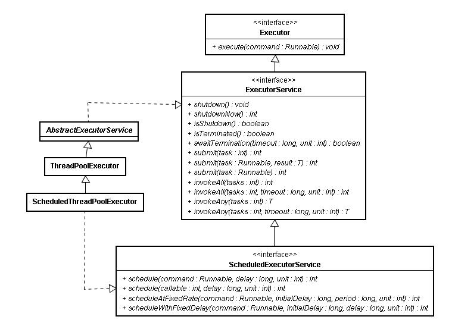
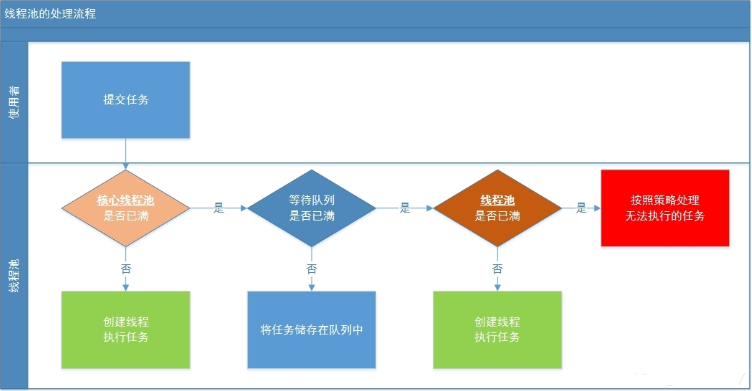
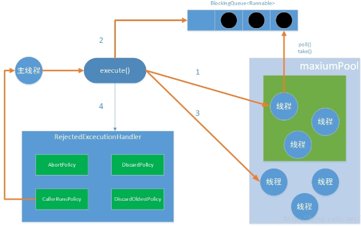

## Java线程池的基本使用和执行流程分析 ##

####1、线程池的实现原理及基本类结构

合理利用线程池能够带来三个好处。

**- 降低资源消耗**。通过重复利用已创建的线程降低线程创建和销毁造成的消耗。

**- 提高响应速度**。当任务到达时，任务可以不需要等到线程创建就能立即执行。

**- 提高线程的可管理性**。线程是稀缺资源，如果无限制的创建，不仅会消耗系统资源，还会降低系统的稳定性，使用线程池可以进行统一的分配，调优和监控。

Executor线程池框架的最大优点是**把任务的提交和执行解耦**。客户端将要执行的任务封装成Task，然后提交即可。而Task如何执行客户端则是透明的。具体点讲，提交一个Callable对象给ExecutorService（如最常用的线程池ThreadPoolExecutor），将得到一个Future对象，调用Future对象的get方法等待执行结果。 

 从图一可知，实际的线程池类是实现 ExecutorService 接口的类，有ThreadPoolExecutor、ForkJoinPool和ScheduledThreadPoolExecutor。**下面以常用的ThreadPoolExecutor为例讲解**。

####2、线程池实现步骤

- **2.1 线程池的创建**

		public ThreadPoolExecutor(
							int corePoolSize,
	                        int maximumPoolSize,
	                        long keepAliveTime,
	                        TimeUnit unit,
	                        BlockingQueue<Runnable> workQueue,
	                        ThreadFactory threadFactory,
	                        RejectedExecutionHandler handler)

	参数说明：

	corePoolSize（线程池的基本线程数）： 当提交一个任务到线程池时，线程池会创建一个线程来执行任务，即使其他空闲的基本线程能够执行新任务也会创建线程，等到需要执行的任务数大于线程池基本大小时就不再创建。如果调用了线程池的prestartAllCoreThreads方法，线程池会提前创建并启动所有基本线程。

	maximumPoolSize（线程池最大线程数）： 线程池允许创建的最大线程数。如果任务队列满了，并且已创建的线程数小于最大线程数，则线程池会再创建新的线程执行任务。值得注意的是如果使用了无界的任务队列这个参数就没什么效果。

	keepAliveTime（线程活动保持时间）：当线程数大于corePoolSize时，终止前多余的空闲线程等待新任务的最长时间。所以如果任务很多，并且每个任务执行的时间比较短，可以调大这个时间，提高线程的利用率。

	TimeUnit（线程活动保持时间的单位）：keepAliveTime的时间单位. 可选的单位有天（DAYS），小时（HOURS），分钟（MINUTES），毫秒(MILLISECONDS)，微秒(MICROSECONDS, 千分之一毫秒)和毫微秒(NANOSECONDS, 千分之一微秒)。

	workQueue（任务队列）：用于保存等待执行的任务的阻塞队列。 可以选择以下几个阻塞队列。 

	--- ArrayBlockingQueue：是一个基于数组结构的有界阻塞队列，此队列按 FIFO（先进先出）原则对元素进行排序。 

	--- LinkedBlockingQueue：一个基于链表结构的阻塞队列，此队列按FIFO （先进先出） 排序元素，吞吐量通常要高于ArrayBlockingQueue。静态工厂方法Executors.newFixedThreadPool()使用了这个队列。 

	---- SynchronousQueue：一个不存储元素的阻塞队列。每个插入操作必须等到另一个线程调用移除操作，否则插入操作一直处于阻塞状态，吞吐量通常要高于LinkedBlockingQueue，静态工厂方法Executors.newCachedThreadPool使用了这个队列。 

	--- PriorityBlockingQueue：一个具有优先级的无限阻塞队列。

	ThreadFactory：用于设置创建线程的工厂，可以通过线程工厂给每个创建出来的线程设置更有意义的名字。

	RejectedExecutionHandler（饱和策略）：当队列和线程池都满了，说明线程池处于饱和状态，那么必须采取一种策略处理提交的新任务。这个策略默认情况下是AbortPolicy，表示无法处理新任务时抛出异常。JDK本身在ThreadPoolExecutor里给用户提供了四种拒绝策略。 

	--- AbortPolicy：直接抛出异常。 

	--- CallerRunsPolicy：只用调用者所在线程来运行任务。 

	--- DiscardOldestPolicy：丢弃队列里最近的一个任务，并执行当前任务。 

	--- DiscardPolicy：不处理，丢弃掉。 

	当然也可以根据应用场景需要来**实现RejectedExecutionHandler接口自定义策略**。如记录日志或持久化不能处理的任务。

	由此可见，创建一个线程所需的参数很多，线程池为我们提供了类Executors的静态工厂方法以创建不同类型的线程池。 

	`Executors.newSingleThreadExecutor()` 只有一个线程的线程池，因此所有提交的任务是顺序执行；
		
	`Executors.newCachedThreadPool()` 创建一个可根据需要创建新线程的线程池，但是在以前构造的线程可用时将重用它们，如果线程超过60秒内没执行，那么将被终止并从池中删除;
		
	`Executors.newFixedThreadPool()` 拥有固定线程数的线程池，如果没有任务执行，那么线程会一直等待;
		
	`Executors.newScheduledThreadPool()` 生成支持周期任务的线程池;
		
	`Executors.newSingleThreadScheduledExecutor()` 只有一个线程周期任务的线程池;
		
- **2.2 向线程池提交任务**

	有两种方式提交任务： 

	1.使用 `void execute(Runnable command)` 方法提交任务 

	execute方法返回类型为void，所以没有办法判断任务是否被线程池执行成功。

		Runnable task = new Runnable() {
		    @Override
		    public void run() {
		        System.out.println("Task is running by " + Thread.currentThread().getName());
		        System.out.println("线程池正在执行的线程数：" + threadPoolExecutor.getActiveCount());
		    }
		};
		threadPool.execute(task);

	2.使用 submit 方法提交任务 

		Future<?> submit(Runnable task);

		<T> Future<T> submit(Runnable task, T result);

		Future<T> submit(Callable<T> task);

	会返回一个Future，可以通过这个future来判断任务是否执行成功，通过future的get方法来获取返回值，get方法会阻塞直到任务完成，而使用get(long timeout, TimeUnit unit)方法则会阻塞一段时间后立即返回，这时有可能任务没有执行完。

		Future<?> future = threadPool.submit(task);
		try {
		    Object result = future.get();
		    System.out.println("任务是否完成：" + future.isDone());
		    System.out.println("返回的结果为：" + result);
		} catch (InterruptedException | ExecutionException e) {
		    e.printStackTrace();
		} finally {
		    // 关闭线程池
		    threadPool.shutdown();
		}
	

- **2.3 线程池关闭**

	**shutdown()方法：**
	这个方法会平滑地关闭ExecutorService，当我们调用这个方法时，ExecutorService停止接受任何新的任务且等待已经提交的任务执行完成(已经提交的任务会分两类：一类是已经在执行的，另一类是还没有开始执行的)，当所有已经提交的任务执行完毕后将会关闭ExecutorService。

	**awaitTermination(long timeout, TimeUnit unit)**
	方法：这个方法有两个参数，一个是timeout即超时时间，另一个是unit即时间单位。这个方法会使当前关闭线程池的线程等待timeout时长，当超过timeout时间后，则去监测ExecutorService是否已经关闭，若关闭则返回true，否则返回false。一般情况下会和shutdown方法组合使用。

	**shutdownNow()**
	方法：这个方法会强制关闭ExecutorService，它将取消所有运行中的任务和在工作队列中等待的任务，这个方法返回一个List列表，列表中返回的是等待在工作队列中的任务。

		//  关闭线程池
		threadPool.shutdown();
		// hreadPool.shutdownNow();
		System.out.println("线程池是否关闭：" + threadPool.isShutdown());
		try {
		    //当前线程阻塞10ms后，去检测线程池是否终止，终止则返回true
		    while(!threadPool.awaitTermination(10, TimeUnit.MILLISECONDS)) {
		        System.out.println("检测线程池是否终止：" + threadPool.isTerminated());
		    }
		} catch (InterruptedException e) {
		    e.printStackTrace();
		}
		System.out.println("线程池是否终止：" + threadPool.isTerminated());

- **2.4 代码示例**

		
		import java.util.concurrent.ExecutionException;
		import java.util.concurrent.ExecutorService;
		import java.util.concurrent.Executors;
		import java.util.concurrent.Future;
		import java.util.concurrent.ThreadPoolExecutor;
		import java.util.concurrent.TimeUnit;
		
		public class ThreadPoolDemo {
		
			public static void main(String[] args) {
				/*
				 * 1. 创建线程池
				 * 
				 * 创建一个固定线程数目的线程池。corePoolSize = maximumPoolSize = 5 即线程池的基本线程数和最大线程数相等。
				 * 相当于： new ThreadPoolExecutor(nThreads, nThreads, 0L,TimeUnit.MILLISECONDS,new LinkedBlockingQueue<Runnable>());
				 */
				ExecutorService threadPool = Executors.newFixedThreadPool(5);
				/*
				 * 2. 封装任务并提交给线程池
				 */
				ThreadPoolExecutor threadPoolExecutor = (ThreadPoolExecutor) threadPool;
				Runnable task = new Runnable() {
					@Override
					public void run() {
						System.out.println("Task is running by " + Thread.currentThread().getName());
						System.out.println("线程池正在执行的线程数：" + threadPoolExecutor.getActiveCount());
						try {
							TimeUnit.SECONDS.sleep(10);
						} catch (InterruptedException e) {
							e.printStackTrace();
						}
					}
				};
				/*
				 * Starts all core threads, causing them to idly wait for work. This
				 * overrides the default policy of starting core threads only when new
				 * tasks are executed.
				 */
				int count = threadPoolExecutor.prestartAllCoreThreads();
				System.out.println("开启的所有core线程数：" + count);
				System.out.println("线程池当前线程数：" + threadPoolExecutor.getPoolSize());
				System.out.println("线程池的core number of threads：" + threadPoolExecutor.getCorePoolSize());
				System.out.println("线程池中的最大线程数：" + threadPoolExecutor.getLargestPoolSize());
				// 3. 执行，获取返回结果
				/**
				 * execute方式提交任务
				 */
				// threadPool.execute(task);
				/**
				 * submit方式提交任务
				 */
				Future<?> future = threadPool.submit(task);
				try {
					// 阻塞，等待线程执行完成，并获得结果
					Object result = future.get();
					System.out.println("任务是否完成：" + future.isDone());
					System.out.println("返回的结果为：" + result);
				} catch (InterruptedException | ExecutionException e) {
					e.printStackTrace();
				} finally {
					System.out.println("线程池中已经执行完的任务数：" + threadPoolExecutor.getCompletedTaskCount());
					// 4. 关闭线程池
					/*
					 * shutdown方法平滑地关闭线程池，将线程池的状态设为：SHUTDOWN
					 * 停止接受任何新的任务且等待已经提交的任务执行完成,当所有已经 提交的任务执行完毕后将会关闭线程池
					 */
					threadPool.shutdown();
					/*
					 * shutdownNow方法强制关闭线程池，将线程池状态设置为：STOP
					 * 取消所有运行中的任务和在工作队列中等待的任务，并返回所有未执行的任务List
					 */
					// hreadPool.shutdownNow();
					System.out.println("线程池是否关闭：" + threadPool.isShutdown());
					try {
						// 当前线程阻塞10ms后，去检测线程池是否终止，终止则返回true
						while (!threadPool.awaitTermination(10, TimeUnit.MILLISECONDS)) {
							System.out.println("检测线程池是否终止：" + threadPool.isTerminated());
						}
					} catch (InterruptedException e) {
						e.printStackTrace();
					}
					System.out.println("线程池是否终止：" + threadPool.isTerminated());
				}
			}
		}

- **输出**
		
		开启的所有core线程数：5
		线程池当前线程数：5
		线程池的core number of threads：5
		线程池中的最大线程数：5
		Task is running by pool-1-thread-1
		线程池正在执行的线程数：1
		任务是否完成：true
		返回的结果为：null
		线程池中已经执行完的任务数：1
		线程池是否关闭：true
		线程池是否终止：true

####3、线程池的执行流程分析

线程池的主要工作流程如下图： 

----
当提交一个新任务到线程池时，线程池的处理流程如下： 

- 首先线程池判断“核心线程池”（corePoolSize）是否已满？没满，创建一个工作线程来执行任务。满了，则进入下个流程。 

- 其次线程池判断工作队列（workQueue）是否已满？没满，则将新提交的任务存储在工作队列里。满了，则进入下个流程。 

- 最后线程池判断整个线程池的线程数是否已超过maximumPoolSize？没超过，则创建一个新的工作线程来执行任务，超过了，则交给拒绝策略来处理这个任务。 

**另一张图：**

----

- 1、如果当前运行的线程少于corePoolSize，则创建新线程来执行任务（需要获得全局锁）；
- 2、如果运行的线程等于或多于corePoolSize ,则将任务加入BlockingQueue；
- 3、如果无法将任务加入BlockingQueue(队列已满并且正在运行的线程数量小于 maximumPoolSize)，则创建新的线程来处理任务（需要获得全局锁）
- 4、如果创建新线程将使当前运行的线程超出maxiumPoolSize（队列已满并且正在运行的线程数量大于或等于 maximumPoolSize），任务将被拒绝，并调用RejectedExecutionHandler.rejectedExecution()方法(线程池会抛出异常，告诉调用者"我不能再接受任务了");
- 5、当一个线程完成任务时，它会从队列中取下一个任务来执行；
- 6、当一个线程无事可做，超过一定的时间（keepAliveTime）时，线程池会判断，如果当前运行的线程数大于 corePoolSize，那么这个线程就被停掉。所以线程池的所有任务完成后，它最终会收缩到 corePoolSize 的大小
		
  线程池采取上述的流程进行设计是为了减少获取全局锁的次数。在线程池完成预热（当前运行的线程数大于或等于corePoolSize）之后，几乎所有的excute方法调用都执行步骤2;
	
	
	
####4、线程池的监控

通过线程池提供的参数进行监控： 

- taskCount：线程池需要执行的任务数量。 

- completedTaskCount：线程池在运行过程中已完成的任务数量。小于或等于taskCount。 

- largestPoolSize：线程池曾经创建过的最大线程数量。通过这个数据可以知道线程池是否满过。如等于线程池的最大大小，则表示线程池曾经满了。 

- getPoolSize:获取线程池的当前线程数。

- getActiveCount：获取活动的线程数。

  通过继承线程池（ThreadPoolExecutor）并重写线程池的beforeExecute，afterExecute和terminated方法，可以在任务执行前，执行后和线程池关闭前干一些事情。如监控任务的平均执行时间，最大执行时间和最小执行时间等。这几个方法在线程池里是空方法。

	/**
	 * 给定的Thread执行Runnable之前调用此方法
	 *
	 * @param t the thread that will run task {@code r}
	 * @param r the task that will be executed
	 */
	protected void beforeExecute(Thread t, Runnable r) { }
	/**
	 * 给定的Runnable完成后执行此方法
	 * This method is invoked by the thread that executed the task. 
	 * @param r the runnable that has completed
	 * @param t the exception that caused termination, or null if
	 * execution completed normally
	 */
	protected void afterExecute(Runnable r, Throwable t) { }
	/**
	 * 当Executor终止时调用此方法.  
	 * 注意：方法中子类应调用super.terminated()
	 */
	protected void terminated() { }

  例如：

	class ExtendedExecutor extends ThreadPoolExecutor {
	      // ...
	      protected void afterExecute(Runnable r, Throwable t) {
	        super.afterExecute(r, t);
	        if (t == null && r instanceof Future<?>) {
	          try {
	            Object result = ((Future<?>) r).get();
	          } catch (CancellationException ce) {
	              t = ce;
	          } catch (ExecutionException ee) {
	              t = ee.getCause();
	          } catch (InterruptedException ie) {
	              Thread.currentThread().interrupt(); // ignore/reset
	          }
	        }
	        if (t != null)
	          System.out.println(t);
	      }
	}
		

参考：

http://www.uml.org.cn/j2ee/201212193.asp 

http://www.jiagou4.com/2015/07/726.html 

http://www.lai18.com/content/1646157.html

http://www.aichengxu.com/view/2456101