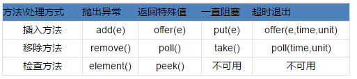
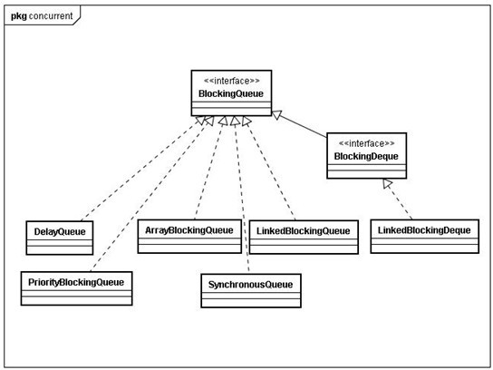

##Java中的阻塞队列 - BlockingQueue ##

####1、什么是阻塞队列？

BlockingQueue即阻塞队列，从阻塞这个词可以看出，在某些情况下对阻塞队列的访问可能会造成阻塞。被阻塞的情况主要有如下两种：
	
	1. 当队列满了的时候进行入队列操作
	2. 当队列空了的时候进行出队列操作

阻塞队列主要用在生产者/消费者的场景，下面这幅图展示了一个线程生产、一个线程消费的场景：

负责生产的线程不断的制造新对象并插入到阻塞队列中，直到达到这个队列的上限值。队列达到上限值之后生产线程将会被阻塞，直到消费的线程对这个队列进行消费。同理，负责消费的线程不断的从队列中消费对象，直到这个队列为空，当队列为空时，消费线程将会被阻塞，除非队列中有新的对象被插入。

阻塞队列提供了四种处理方法:

- 抛出异常：是指当阻塞队列满时候，再往队列里插入元素，会抛出IllegalStateException("Queue full")异常。当队列为空时，从队列里获取元素时会抛出NoSuchElementException异常 。
- 返回特殊值：插入方法会返回是否成功，成功则返回true。移除方法，则是从队列里拿出一个元素，如果没有则返回null
- 一直阻塞：当阻塞队列满时，如果生产者线程往队列里put元素，队列会一直阻塞生产者线程，直到拿到数据，或者响应中断退出。当队列空时，消费者线程试图从队列里take元素，队列也会阻塞消费者线程，直到队列可用。
- 超时退出：当阻塞队列满时，队列会阻塞生产者线程一段时间，如果超过一定的时间，生产者线程就会退出。

####2、Java里的阻塞队列

JDK提供的阻塞队列。分别是

- ArrayBlockingQueue ：一个用数组实现的有界阻塞队列，其构造函数必须带一个int参数来指明其大小.其所含的对象是以FIFO(先入先出)顺序排序的。
- LinkedBlockingQueue ：大小不定的阻塞队列，若其构造函数带一个规定大小的参数，生成的阻塞队列有大小限制，若不带大小参数，所生成的阻塞队列的大小由Integer.MAX_VALUE来决定。其所含的对象是以FIFO(先入先出)顺序排序的。
- PriorityBlockingQueue ：一个支持优先级排序的无界阻塞队列，类似于LinkedBlockQueue,但其所含对象的排序不是FIFO,而是依据对象的自然排序顺序或者是构造函数的Comparator决定的顺序。
- DelayQueue：一个支持延时获取元素的无界阻塞队列。
- SynchronousQueue：一个不存储元素的特殊的阻塞队列,对其的操作必须是放和取交替完成的。
- LinkedBlockingDeque：一个由链表结构组成的双向阻塞队列。

**ArrayBlockingQueue**   

是一个有边界的阻塞队列，它的内部实现是一个数组。有边界的意思是它的容量是有限的，我们必须在其初始化的时候指定它的容量大小，容量大小一旦指定就不可改变。

默认情况下不保证访问者公平的访问队列，所谓公平访问队列是指阻塞的所有生产者线程或消费者线程，当队列可用时，可以按照阻塞的先后顺序访问队列，即先阻塞的生产者线程，可以先往队列里插入元素，先阻塞的消费者线程，可以先从队列里获取元素。

通常情况下为了保证公平性会降低吞吐量。我们可以使用以下代码创建一个公平的阻塞队列：

		ArrayBlockingQueue fairQueue = new  ArrayBlockingQueue(1000,true);

ArrayBlockingQueue是以先进先出的方式存储数据，最新插入的对象是尾部，最新移出的对象是头部。下面是一个初始化和使用ArrayBlockingQueue的例子：

		BlockingQueue queue = new ArrayBlockingQueue(1024);
		queue.put("1");
		Object object = queue.take();

**LinkedBlockingQueue**  

是一个用链表实现的阻塞队列。队列大小的配置是可选的，如果我们初始化时指定一个大小，它就是有边界的，如果不指定，它就是无边界的。说是无边界，其实是采用了默认大小为Integer.MAX_VALUE的容量 。

和ArrayBlockingQueue一样，LinkedBlockingQueue 也是以先进先出的方式存储数据，最新插入的对象是尾部，最新移出的对象是头部。下面是一个初始化和使LinkedBlockingQueue的例子：

		BlockingQueue<String> unbounded = new LinkedBlockingQueue<String>();
		BlockingQueue<String> bounded   = new LinkedBlockingQueue<String>(1024);
		bounded.put("Value");
		String value = bounded.take();

**PriorityBlockingQueue：**   

是一个支持优先级的无界队列。默认情况下元素采取自然顺序排列，也可以通过比较器comparator来指定元素的排序规则。元素按照升序排列。

下面我们举个例子来说明一下，首先我们定义一个对象类型，这个对象需要实现Comparable接口：

		public class PriorityElement implements Comparable<PriorityElement> {
			private int priority;//定义优先级
			PriorityElement(int priority) {
			    //初始化优先级
			    this.priority = priority;
			}
			@Override
			public int compareTo(PriorityElement o) {
			    //按照优先级大小进行排序
			    return priority >= o.getPriority() ? 1 : -1;
			}
			public int getPriority() {
			    return priority;
			}
			public void setPriority(int priority) {
			    this.priority = priority;
			}
			@Override
			public String toString() {
			    return "PriorityElement [priority=" + priority + "]";
			}
		}

然后我们把这些元素随机设置优先级放入队列中

		public class PriorityBlockingQueueExample {
			public static void main(String[] args) throws InterruptedException {
			    PriorityBlockingQueue<PriorityElement> queue = new PriorityBlockingQueue<>();
			    for (int i = 0; i < 5; i++) {
			        Random random=new Random();
			        PriorityElement ele = new PriorityElement(random.nextInt(10));
			        queue.put(ele);
			    }
			    while(!queue.isEmpty()){
			        System.out.println(queue.take());
			    }
			}
		}

看一下运行结果：

	PriorityElement [priority=3]
	PriorityElement [priority=4]
	PriorityElement [priority=5]
	PriorityElement [priority=8]
	PriorityElement [priority=9]

**DelayQueue**  

是一个支持延时获取元素的无界阻塞队列。队列中的元素必须实现Delayed接口，在创建元素时可以指定多久才能从队列中获取当前元素。只有在延迟期满时才能从队列中提取元素。我们可以将DelayQueue运用在以下应用场景：

DelayQueue应用场景很多，比如定时关闭连接、缓存对象，超时处理等各种场景，下面我们就拿学生考试为例让大家更深入的理解DelayQueue的使用。

例：把所有考试的学生看做是一个DelayQueue，谁先做完题目释放谁

首先，我们构造一个学生对象
		
		public class Student implements Runnable,Delayed{
		  private String name;  //姓名
		  private long costTime;//做试题的时间
		  private long finishedTime;//完成时间
		
		  public Student(String name, long costTime) {
		         this. name = name;
		         this. costTime= costTime;
		         finishedTime = costTime + System. currentTimeMillis();
		  }
		
		  @Override
		  public void run() {
		        System. out.println( name + " 交卷,用时" + costTime /1000);
		  }
		
		  @Override
		  public long getDelay(TimeUnit unit) {
		         return ( finishedTime - System. currentTimeMillis());
		  }
		
		  @Override
		  public int compareTo(Delayed o) {
		        Student other = (Student) o;
		         return costTime >= other. costTime?1:-1;
		  }
		
		}

然后在构造一个教师对象对学生进行考试

		public class Teacher {
		  static final int STUDENT_SIZE = 30;
		  public static void main(String[] args) throws InterruptedException {
		        Random r = new Random();
		        //把所有学生看做一个延迟队列
		        DelayQueue<Student> students = new DelayQueue<Student>();
		        //构造一个线程池用来让学生们“做作业”
		        ExecutorService exec = Executors.newFixedThreadPool(STUDENT_SIZE);
		         for ( int i = 0; i < STUDENT_SIZE; i++) {
		               //初始化学生的姓名和做题时间
		               students.put( new Student( "学生" + (i + 1), 3000 + r.nextInt(10000)));
		        }
		        //开始做题
		        while(! students.isEmpty()){
		               exec.execute( students.take());
		        }
		         exec.shutdown();
		  }
		}

我们看一下运行结果：

	学生2 交卷,用时3
	学生1 交卷,用时5
	学生5 交卷,用时7
	学生4 交卷,用时8
	学生3 交卷,用时11

通过运行结果我们可以发现，每个学生在指定开始时间到达之后就会“交卷”（取决于getDelay()方法），并且是先做完的先交卷（取决于compareTo()方法）。

**SynchronousQueue**  

是一个不存储元素的阻塞队列。每一个put操作必须等待一个take操作，否则不能继续添加元素。SynchronousQueue可以看成是一个传球手，负责把生产者线程处理的数据直接传递给消费者线程。队列本身并不存储任何元素，非常适合于传递性场景,比如在一个线程中使用的数据，传递给另外一个线程使用，SynchronousQueue的吞吐量高于LinkedBlockingQueue 和 ArrayBlockingQueue。

**LinkedBlockingDeque**  

LinkedBlockingDeque是双向链表实现的双向并发阻塞队列。该阻塞队列同时支持FIFO和FILO两种操作方式，即可以从队列的头和尾同时操作(插入/删除)；并且，该阻塞队列是支持线程安全。

此外，LinkedBlockingDeque还是可选容量的(防止过度膨胀)，即可以指定队列的容量。如果不指定，默认容量大小等于Integer.MAX_VALUE。

阻塞栈的例子（FILO）：

	import java.util.concurrent.BlockingDeque;
	import java.util.concurrent.LinkedBlockingDeque;
	
	public class BlockingDequeTest {
		public static void main(String[] args) throws InterruptedException {
			BlockingDeque<String> bDeque = new LinkedBlockingDeque<String>(20);
			for (int i = 0; i < 30; i++) {
				// 将指定元素添加到此阻塞栈中
				bDeque.putFirst("" + i);
				System.out.println("向阻塞栈中添加了元素:" + i);
				if (i > 18) {
					// 从阻塞栈中取出栈顶元素，并将其移出
					System.out.println("从阻塞栈中移出了元素：" + bDeque.pollFirst());
				}
			}
			System.out.println("程序到此运行结束，即将退出----");
		}
	}
输出

	向阻塞栈中添加了元素:0
	向阻塞栈中添加了元素:1
	向阻塞栈中添加了元素:2
	向阻塞栈中添加了元素:3
	向阻塞栈中添加了元素:4
	向阻塞栈中添加了元素:5
	向阻塞栈中添加了元素:6
	向阻塞栈中添加了元素:7
	向阻塞栈中添加了元素:8
	向阻塞栈中添加了元素:9
	向阻塞栈中添加了元素:10
	向阻塞栈中添加了元素:11
	向阻塞栈中添加了元素:12
	向阻塞栈中添加了元素:13
	向阻塞栈中添加了元素:14
	向阻塞栈中添加了元素:15
	向阻塞栈中添加了元素:16
	向阻塞栈中添加了元素:17
	向阻塞栈中添加了元素:18
	向阻塞栈中添加了元素:19
	从阻塞栈中移出了元素：19
	向阻塞栈中添加了元素:20
	从阻塞栈中移出了元素：20
	向阻塞栈中添加了元素:21
	从阻塞栈中移出了元素：21
	向阻塞栈中添加了元素:22
	从阻塞栈中移出了元素：22
	向阻塞栈中添加了元素:23
	从阻塞栈中移出了元素：23
	向阻塞栈中添加了元素:24
	从阻塞栈中移出了元素：24
	向阻塞栈中添加了元素:25
	从阻塞栈中移出了元素：25
	向阻塞栈中添加了元素:26
	从阻塞栈中移出了元素：26
	向阻塞栈中添加了元素:27
	从阻塞栈中移出了元素：27
	向阻塞栈中添加了元素:28
	从阻塞栈中移出了元素：28
	向阻塞栈中添加了元素:29
	从阻塞栈中移出了元素：29
	程序到此运行结束，即将退出----

参考：

http://blog.csdn.net/suifeng3051/article/details/48807423

http://www.infoq.com/cn/articles/java-blocking-queue/