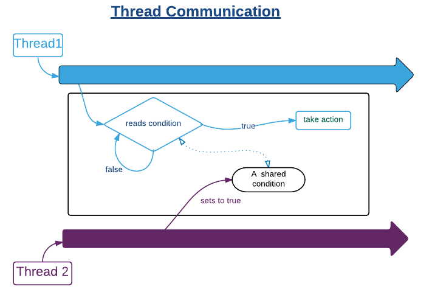

###线程间通讯

http://blog.csdn.net/suifeng3051/article/details/51863010?locationNum=2

在多线程编程中，通常遇到一个线程等待另一个线程的结果，然后继续采取下一步操作的场景。

通常这种情况下需要开发人员使用一些基于共享变量的方式来实现线程间通信。

代码示例：

	public class SimpleWaitNotifyDemo {
		
		private static String message;
	
		public static void main(String[] args) {
			Object lock = new Object();
	
			Thread thread1 = new Thread(() -> {
				synchronized (lock) {
					while (message == null) {
						try {
							lock.wait();
						} catch (InterruptedException e) {
							e.printStackTrace();
						}
					}
				}
	
				System.out.println(message);
			});
	
			Thread thread2 = new Thread(() -> {
				synchronized (lock) {
					message = "A message from thread1";
					lock.notify();
				}
			});
	
			thread1.start();
			thread2.start();
		}
	}

我们可以修改上面的示例来将同步和线程通信合并到单个对象：

	public class WaitNotifyDemo {
	
	    public static void main (String[] args) {
	        SharedObject obj = new SharedObject();
	
	        Thread thread1 = new Thread(() -> {
	            obj.printMessage();
	        });
	
	        Thread thread2 = new Thread(() -> {
	            obj.setMessage("A message from thread1");
	        });
	
	        thread1.start();
	        thread2.start();
	    }
	
	    private static class SharedObject {
	        private String message;
	
	        public synchronized void setMessage (String message) {
	            this.message = message;
	            notify();
	        }
	
	        public synchronized void printMessage () {
	            while (message == null) {
	                try {
	                    wait();
	                } catch (InterruptedException e) {
	                    e.printStackTrace();
	                }
	            }
	            System.out.println(message);
	
	        }
	    }
	}

----------

**sleep和wait方法的区别**

**sleep 方法**

1. sleep 使当前线程进入停滞状态（阻塞当前线程），让出CUP的使用、目的是不让当前线程独自霸占该线程所获的CPU资源，留一定CPU时间给其他线程执行的机会;
	
2. sleep 是Thread类的Static(静态)的方法；因此他不能改变对象的内置锁，所以当在一个Synchronized块中调用Sleep方法时，线程虽然休眠了，但是对象的内置锁并没有被释放，其他线程无法访问这个对象（即使睡着也持有对象锁）。
	
3. 在 sleep 休眠时间期满后，该线程不一定会立即执行，这是因为其它线程可能正在运行而且没有被调度为放弃执行，除非此线程具有更高的优先级。 

 
**wait 方法**

wait 方法是Object类里的方法；当一个线程执行到wait方法时，它就进入到一个和该对象相关的等待池中，暂时先把对象内置锁给让出，给其它持有该锁的线程使用，其它线程用完后再告知（notify或者notifyAll）等待的那个线程可以继续执行了，因此，wait方法只有在synchronized中才有意义，否则会在程序运行时扔出 java.lang.IllegalMonitorStateException 异常。
 

所以 sleep 和 wait 方法的最大区别是：

1. sleep 睡眠时，保持对象锁，仍然占有该锁；
2. 而 wait 睡眠时，释放对象锁。
3. 但是 wait 和  sleep都可以通过 interrupt 方法打断线程的暂停状态，从而使线程立刻抛出InterruptedException。

**notify 和 notifyAll方法的区别**

notify 唤醒在该对象的监视器（内置锁）等待的单个线程。 如果多个线程正在等待，则只有其中一个将被通知或将被唤醒; 哪个线程被通知是不可预测的，完全取决于调度程序。

notifyAll 唤醒所有调用wait而在该对象的监视器（内置锁）处于等待状态的全部线程。

notify和notifyAll同样在synchronized中被调用才有意义。
